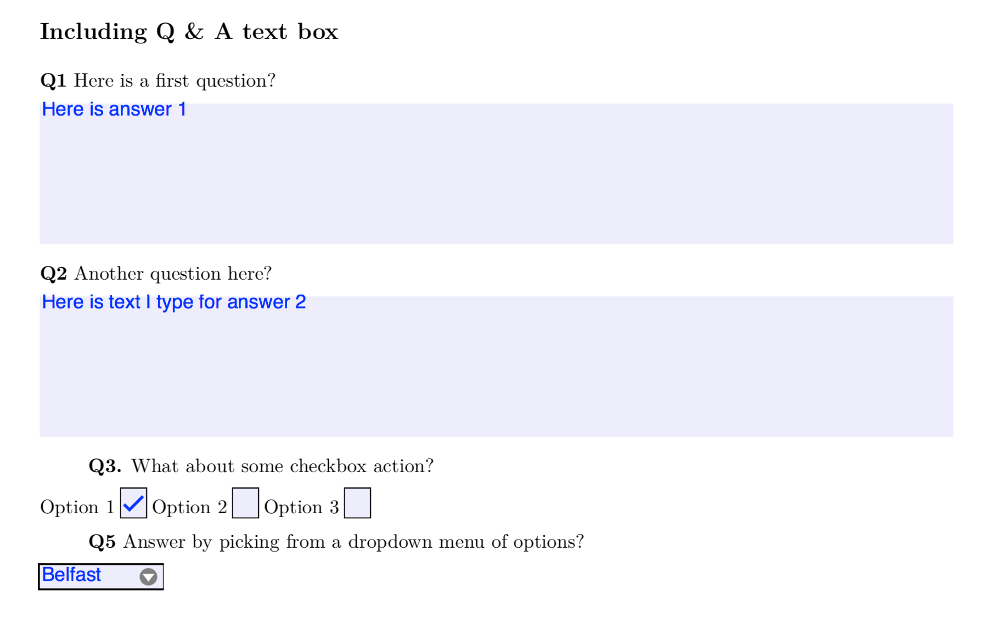

# How to make and query fillable PDF forms from R  

By combining Rmarkdown with the good old [LaTex `hyperref` package](http://ctan.math.washington.edu/tex-archive/macros/latex/contrib/hyperref/doc/manual.html) we can create resonable PDF forms for Question/Answer style worksheets without the need for Adobe software. 

We can also use the [`staplr` package](https://github.com/pridiltal/staplr) to extract (or set) filled in values from completed forms. 

I find the `hyperref` documentation to be rather poor. One useful resource for paramaters can be [found here](https://www.tug.org/applications/hyperref/manual.html#x1-470006). Needless to say the styling and LaTex settings for hyperref in these example docs has been hard earned. 

For a quick demo of how to make PDF forms with Rmarkdown see the input file `mk_pdf_form.Rmd` and coresponding output [`mk_pdf_form.pdf`](https://github.com/bioboot/pdf_forms/blob/master/mk_pdf_form.pdf).

To extract and/or set form responses see the repo file  `extract_form_data.R`.

